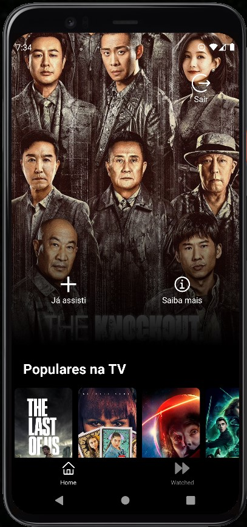

<h4 align="center"> 
	🚧  Under development
</h4>

Home Screen | Details Screen | Watched Screen
:---: | :---:| :---:|
 |  |  |

### The Movie Database API

#### implementar login
- [x] Create new Token (request_token)
- [x] Login (sucess)

#### implementar bottom nav
- [x] Create Session (session_id)
- [x] List Fav

#### implementar adição aos favoritos
- [x] Create Session (session_id)
- [x] Get Account Info (account id)
- [ ] Fav

#### implementar pesquisa
- [ ] 

#### tarefas
- [x] tela de login
- [ ] tela de cadastro
