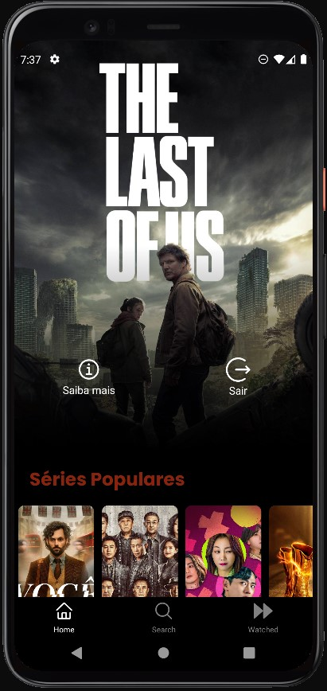

<!-- ICON APP -->
<div align="center">
   
</div>

<!-- Shields -->
<div align="center">
  
  
</div>

# Watched

Mantenha uma lista de todos os filmes e séries que você já assistiu.

https://github.com/EmmanuellaAlbuquerque/Watched/assets/57198678/def53002-6e9c-4d35-8b0d-b4bbedcc6034

## :art: Telas

Login Screen | Home Screen | Details Screen (Watched)
:---: | :---:| :---:|
 |  |  |

Search Screen | Watched Screen | Details Screen (Not Watched)
:---: | :---:| :---:|
 |  |  |

## ✨ Tecnologias

Esse projeto foi desenvolvido com as seguintes tecnologias:

- [React-Native](https://reactnative.dev/)
- [Expo](https://expo.dev/)


API do The Movie Database (TMDb) que mantém um banco de dados, atualizado constantemente, com os filmes e séries mais recentes.
- [themoviedb](https://developers.themoviedb.org/3/getting-started/introduction) - The Movie Database API

## :rocket: Executando o projeto

### Versions Used

- Node 17
- Expo 47
- React Native 0.70.5

Primeiramente, lembre-se de obter a API KEY do ([TMDb](https://developers.themoviedb.org/3/getting-started/introduction)). Em seguida, defina o arquivo .env na home do projeto.
 
 ```sh
# .env.example

THEMOVIEDB_APIKEY=
```

Utilize o **yarn** ou o **npm install** para instalar as dependências do projeto.
Em seguida, inicie o projeto.

```sh
nvm use 17
nvm current

npx expo start
```

## :iphone: APK

[Android APK](.github/APK/Watched.apk)

## :hammer_and_wrench: Tarefas

#### implementar login
- [x] Create new Token (request_token)
- [x] Login (sucess)

#### implementar bottom nav
- [x] Create Session (session_id)
- [x] List Watched

#### implementar adição aos assistidos
- [x] Create Session (session_id)
- [x] Get Account Info (account id)
- [x] Add to Watched

#### implementar pesquisa
- [x] For movies
- [x] For series

## ✍️ Autor

<a href="https://github.com/EmmanuellaAlbuquerque">
  
</a>

Made with ❤️ by <a href="https://github.com/EmmanuellaAlbuquerque">Manu</a>